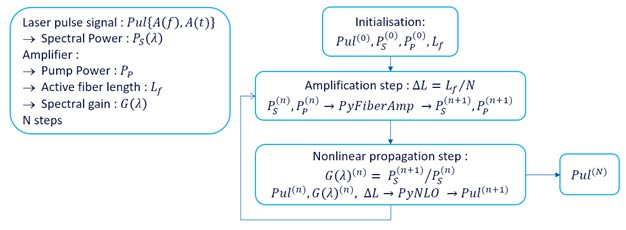

# Gain-Managed Nonlinear Amplifier

### Demonstration of nonlinear laser amplifier calculation similar to the results presented in Pavel Sidorenko *et al.* papers 1, 2

1 Generation of 1 μJ and 40 fs pulses from a large mode area gain-managed nonlinear amplifier   
Pavel Sidorenko* AND Frank Wise; Optics Letters, Vol. 45, No. 14, 15 July 2020 ; 
2 Nonlinear ultrafast fiber amplifiers beyond the gain-narrowing limit   
Pavel Sidorenko*, Walter Fu, AND Frank Wise; Optica Vol. 6, No. 10, 2019  
https://arxiv.org/pdf/1906.04141.pdf
___

## Description

Researchers from the [Wise Research Group](https://wise.research.engineering.cornell.edu/) reported
*Gain Managed Nonlinear Amplification* of short laser pulses. The nonlinear effect experienced by the
laser pulse in the amplifier's active fiber results in pulse spectral broadening.
The amplification regime is such that the gained pulse spectral width can be use to compress the 
laser pulse to shorter temporal width. 

As show in the Sidorenko *et al.* [papers](https://arxiv.org/pdf/1906.04141.pdf) the modeling of 
the pulse evolution can be done with the generalized nonlinear Schrödinger equation (GNLSE).

Here is a basic simulation model of such nonlinear laser amplifier that is built using : 
- **pyNLO** packagesee note : https://pynlo.readthedocs.io/en/latest/pynlo.html ; https://github.com/pyNLO/PyNLO
- **pyfiberamp** package : https://pyfiberamp.readthedocs.io/en/latest/readme_link.html#download ; https://github.com/Jomiri/pyfiberamp

The simulation process is illustrated below :

The amplifier active fiber is dived into N segments, for the N simulation steps. For a calculation step,
first the laser signal amplification is calculated with PyFiberAmp, giving the laser pulse spectral
power and residual pump power at the end of the segment. Second, the laser pulse nonlinear propagation
into the segment is calculated with PyNLO. This is repeated for the N segments of the amplifier active fiber.

 

### Note
Few modifications to the **pyNLO** package have been made
- **PulseBase.py** : Modification of the original `spectrogram`method to return back full spectrogram array,
        not only the upper part: modifications use `h`, rather than `h//2`, in the following code lines : 
        `spectrogram = spectrogram[:h]`  
        `DELAYS      = DELAYS[:h]`  
        `FREQS       = FREQS[:h]`  
        This in an alternate method named : `spectrogram_PG()`
- **fiber.py** : Modification of the original `generate_fiber`method to test all array elements for gain, i.e. replace ` if gain == 0:` by ` if np.all(gain == 0]: ` . This in an alternate method named : `generate_fiber_PG()`
- **SSPM.py** : Replace `np.float` by `float`
  